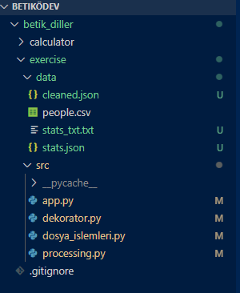

# Betik Diller Ödevi

Bu proje, bir CSV dosyasındaki kişisel verileri okuyup:
- Eksik veya hatalı kayıtları temizleyen,
- Yaş ortalamasını ve şehir bazlı kişi sayılarını hesaplayan,
- Sonuçları JSON ve TXT dosyalarına kaydeden bir **Python uygulamasıdır**.

## Örnek Çıktılar

